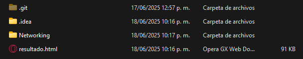
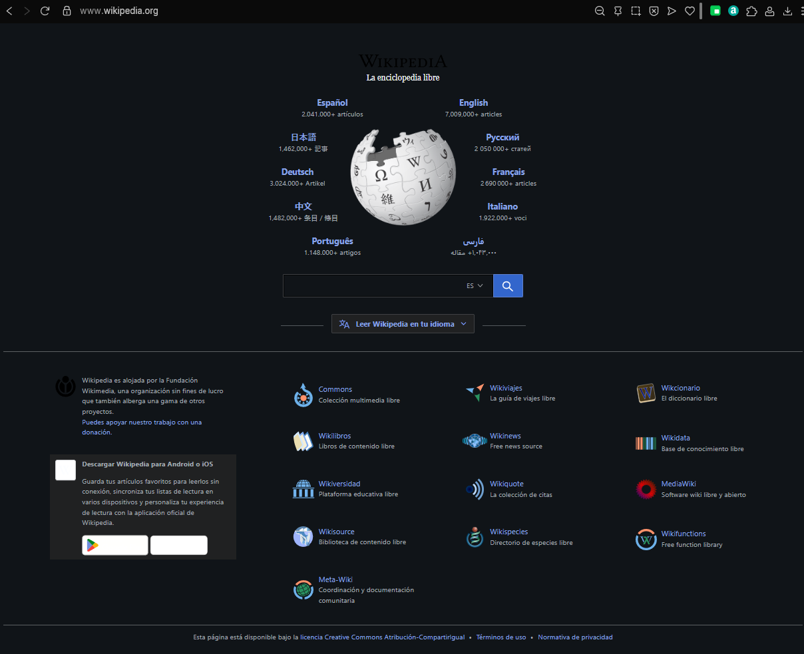
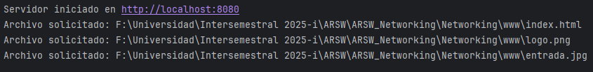

# ARSW - Nombres, redes, clientes y servidores
## Nicolás Prieto Vargas  

## 1. Leyendo los valores de un objeto URL

Escriba un programa en el cual usted cree un objeto URL e imprima en
pantalla cada uno de los datos que retornan los métodos: getProtocol, getAuthority, getHost, getPort, getPath, getQuery,
getFile, getRef.

Este ejercicio se realiza en el archivo URLReader.java de la siguiente manera:

utiliza la clase URL del paquete java.net para analizar y descomponer la dirección web http://www.google.com/. Al 
ejecutarse, crea un objeto URL con esa dirección y luego imprime y guarda en una lista (metodos) diferentes componentes
de la URL: el protocolo (como "http"), la autoridad (host y puerto juntos), el host (por ejemplo, "www.google.com"), el
puerto (si está definido), la ruta del recurso (path), la consulta (query), el archivo completo (path + query) y la
referencia (fragmento tras #, si lo hubiera). Esencialmente, sirve como ejemplo para mostrar cómo descomponer una URL
en sus partes con Java. Este programa sirve con cualquier URL, en este caso la respuesta con la URL de gooogle sería:

## 2. Leyendo páginas de internet
Escriba una aplicación browser que pregunte una dirección URL al usuario
y que lea datos de esa dirección y que los almacene en un archivo con el nombre
resultado.html.  
Luego intente ver este archivo en el navegador.

Este ejercicio se realiza en el archivo NavegadorApp.java

Este programa en Java simula el comportamiento básico de un navegador web. Solicita al usuario que ingrese una URL (como
https://www.google.com) a través de la consola. Luego, intenta conectarse a esa dirección usando la clase URL, y si tiene
éxito, lee línea por línea el contenido HTML de la página usando un BufferedReader. Ese contenido se guarda localmente
en un archivo llamado resultado.html mediante un BufferedWriter. Si la URL es inválida o ocurre un error durante la
lectura o escritura del archivo, el programa captura y muestra el mensaje de error correspondiente. En resumen, descarga
el contenido de una página web y lo guarda en un archivo HTML local. Para este ejercicio, se hará con la URL de wikipedia.

Se crea el archivo resultado.html en la carpeta del repositorio.

Y al abrir resultado.html.

Observamos que no cargan las imágenes pero si el texto como es y en las posiciones originales

Esta es la imagen de la página original

## 3. Implementación de servidor

Escriba un servidor que reciba un número y responda el cuadrado de este
número.

Este ejercicio se realiza en los archivos ServidorCuadrado.java y ClienteCuadrado.java.

Este conjunto de programas en Java implementa una aplicación cliente-servidor simple usando sockets para calcular el 
cuadrado de un número. El archivo ServidorCuadrado.java actúa como servidor: escucha conexiones entrantes en el puerto 
35000, acepta un número enviado por un cliente, lo intenta convertir a entero, calcula su cuadrado y lo imprime en 
consola. Por otro lado, ClienteCuadrado.java se conecta al servidor local (localhost),
solicita al usuario un número, lo envía al servidor y espera una respuesta la cual se imprime en consola.

Al correr el programa debemos primero ejecutar el Servidor, y luego el cliente, dando como resultado:

  

## 4. Servidor web

Escriba un servidor web que soporte múltiples solicitudes seguidas (no concurrentes). El servidor debe retornar todos
los archivos solicitados, incluyendo páginas html e imágenes.

Este ejercicio se realiza en el archivo WebServer.java

Este programa en Java implementa un servidor web básico que escucha en el puerto 8080 y sirve archivos estáticos desde
un directorio local definido (ROOT). Al iniciarse, el servidor acepta conexiones entrantes, lee la solicitud HTTP (solo
maneja peticiones GET), y busca el archivo correspondiente dentro del directorio raíz. Si el archivo solicitado existe y
no es un directorio, lo envía al cliente con los encabezados HTTP adecuados, incluyendo el tipo MIME determinado por la
extensión del archivo. Si el archivo no existe, responde con un error 404 Not Found y muestra un mensaje HTML simple. 
Para este programa se creó una página html sencilla con texto y dos imágenes.

Al programa se le pidió que mostrara qué elemento se estaba solicitando, quedando de la siguiente manera.

La página es así:

## 5. Datagramas

Utilizando Datagramas escriba un programa que se conecte a un servidor
que responde la hora actual en el servidor. El programa debe actualizar la hora
cada 5 segundos según los datos del servidor. Si una hora no es recibida debe
mantener la hora que tenía. Para la prueba se apagará el servidor y después de
unos segundos se reactivará. El cliente debe seguir funcionando y actualizarse
cuando el servidor esté nuevamente funcionando.
